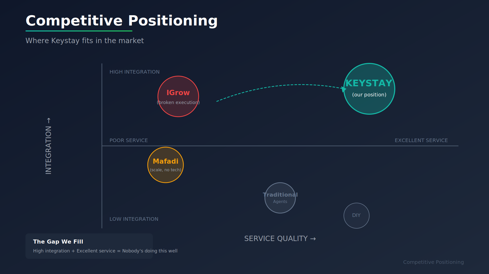
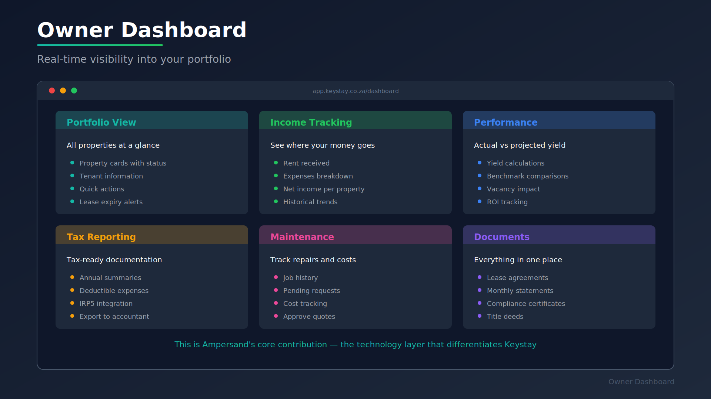
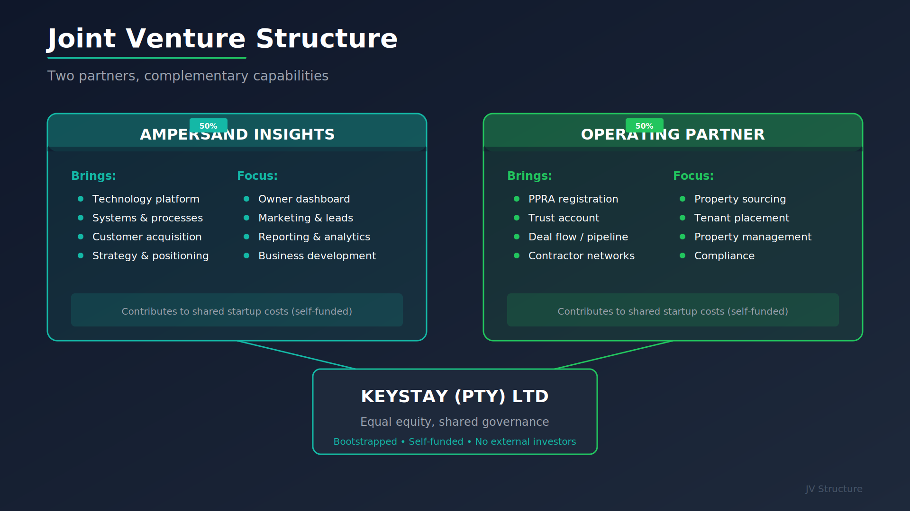
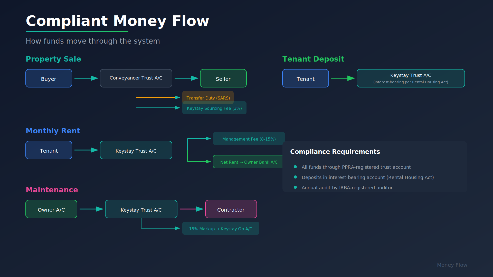
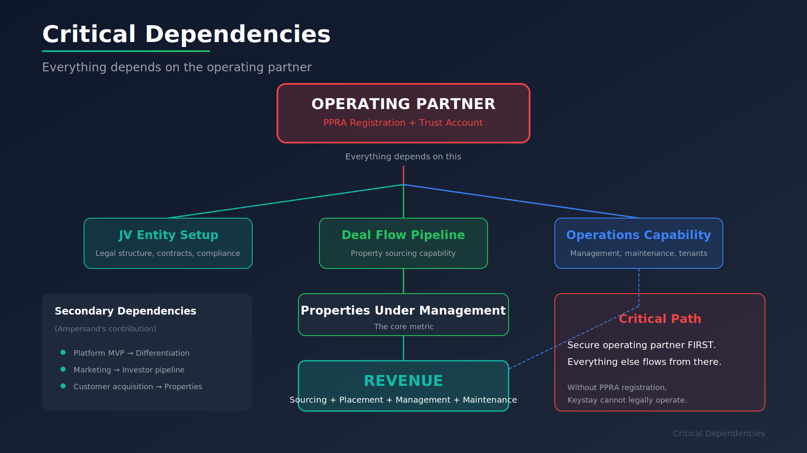

# Keystay Business Plan

**Version:** 1.0
**Date:** 22 January 2026
**Status:** Partner Acquisition Phase
**Prepared by:** Ampersand Insights

---

## Executive Summary

**Keystay** is a vertically integrated property investment platform that enables South Africans to own residential property and earn passive income — without the hassle of being a landlord.

### The Opportunity

South Africa has 220,000+ individuals seeking rental property investment, but current solutions force an unacceptable trade-off:

| Current Option | What You Get | What You Sacrifice |
|----------------|--------------|-------------------|
| **DIY Ownership** | Full control, real ownership | Your time, peace of mind |
| **Fractional Platforms** (EasyProperties) | Passive, low entry point | Real ownership — you hold shares, not property |
| **Integrated Providers** (IGrow) | End-to-end service promise | Transparency — hidden fees, poor communication, locked ecosystem |

**The gap we fill:** Real ownership + truly passive income + transparent, technology-enabled service.

### The Product

### The Business Model

Revenue flows from four streams:

| Stream | Fee | When | Example (R1M property, R8k rent) |
|--------|-----|------|----------------------------------|
| **Sourcing** | 3% of purchase price | At acquisition | R30,000 |
| **Placement** | 1 month rent | Per tenant | R8,000 |
| **Management** | 8% (LT) / 15% (STR) | Monthly | R640 / R1,725 |
| **Maintenance** | 15% markup | Per job | ~R150/month avg |

**Unit Economics:**
- 5-Year LTV (Long-term rental): **R101,400** per property
- 5-Year LTV (Short-term rental): **R145,500** per property
- EBITDA Margin at scale: **65-75%**

### Critical Success Factor

**Keystay cannot legally operate without a PPRA-registered property practitioner as the operating partner.** This is not optional — it is South African regulatory law.

The business launches when we secure the right partner.

---

## Part 1: The Opportunity

### Market Context

South Africa's property investment market is characterised by:

1. **Strong rental yields** — 8-12% gross in entry-level Gauteng properties
2. **Property as inflation hedge** — decades of cultural preference for bricks-and-mortar
3. **Underserved investors** — 220,000+ people want passive income from property, not a second job
4. **Broken incumbents** — All existing solutions have systemic execution failures

### Competitive Landscape

### Competitor Weaknesses

| Competitor | Model | Critical Weakness | Our Advantage |
|------------|-------|-------------------|---------------|
| **IGrow** | Vertically integrated | Poor communication, hidden fees, locked ecosystem (3.6/5 Trustpilot) | Transparent fees, no lock-in, tech-enabled communication |
| **EasyProperties** | Fractional shares | No real ownership (you buy company shares), illiquid exit | Title deed in your name, can sell anytime |
| **Mafadi** | Property management | "Spaza shop operations", no investor sourcing, poor systems | End-to-end service, modern technology |
| **Traditional Agents** | Sales only | Disappear after sale, no ongoing relationship | Lifetime relationship from purchase to passive income |

### The Core Insight

The #1 complaint across every competitor is **communication**. This is a systems problem that technology solves. Our platform creates the transparency and responsiveness that incumbents cannot deliver with manual processes.

---

### Business Model Overview

---

## Part 2: The Product

### Service Lines

#### 1. Property Sourcing

Find and acquire investment properties for buyers seeking income-generating assets.

| Ownership Model | Description | Target Buyer |
|-----------------|-------------|--------------|
| **Full ownership** | Buyer owns 100% of title deed. Traditional model with full control. | Investors with R500k+ capital |
| **Fractional ownership** | Multiple buyers share ownership via SPV or undivided shares. Lower entry point. | New investors, portfolio diversifiers |

**Target Properties:**

| Tier | Price Range | Expected Yield | Property Type |
|------|-------------|----------------|---------------|
| Entry | R500k – R800k | 10-12% gross | 1-2 bed apartments |
| Mid | R800k – R1.2M | 9-10% gross | 2-3 bed sectional title |
| Premium | R1.2M – R2M | 8-9% gross | Houses, larger units |

**Geographic Focus:** Initially Gauteng (Pretoria, Centurion, Midrand, Johannesburg) with national expansion through partner network.

**Fee:** 3% of purchase price

#### 2. Tenant Placement

Find and place occupants in properties to generate income for owners.

| Occupancy Model | Description | Yield Profile |
|-----------------|-------------|---------------|
| **Long-term rental** | 12+ month leases. Stable, predictable income. | 8-10% gross |
| **Short-term rental** | Airbnb, Booking.com, etc. Higher yield, more management. | 12-15% gross (60% occupancy) |

**Fee:** 1 month rent (placement), 50% of placement fee (renewal every ~2 years)

#### 3. Property Management

Ongoing management of tenanted properties for hands-off ownership.

| Service | Description |
|---------|-------------|
| Rent collection | Collect from tenants, disburse to owners after fees |
| Maintenance | Coordinate repairs, manage contractor network |
| Tenant relations | Handle queries, renewals, issues, evictions |
| Reporting | Monthly statements, annual tax summaries |

**Fee:**
- Long-term: 8% of rent collected
- Short-term: 15% of net revenue (higher operational load)
- Maintenance: 15% markup on job cost

#### 4. Owner Dashboard

Technology platform giving owners real-time visibility into their portfolio.

---

## Part 3: The Business Model

### Revenue Streams

Revenue comes from two categories: **once-off fees** (sourcing, placement) that spike cash flow, and **recurring fees** (management, maintenance) that compound over time.

### Unit Economics: The Reference Property

**R1,000,000 property, R8,000/month rent (long-term)**

| Revenue Type | Year 1 | Year 2 | Year 3 | Year 4 | Year 5 | Total |
|--------------|--------|--------|--------|--------|--------|-------|
| Sourcing | R30,000 | - | - | - | - | R30,000 |
| Placement | R8,000 | - | R8,000 | - | R8,000 | R24,000 |
| Management | R7,680 | R7,680 | R7,680 | R7,680 | R7,680 | R38,400 |
| Maintenance | R1,800 | R1,800 | R1,800 | R1,800 | R1,800 | R9,000 |
| **Total** | **R47,480** | **R9,480** | **R17,480** | **R9,480** | **R17,480** | **R101,400** |

**5-Year LTV: R101,400 per property (long-term)**

**Short-term rental comparison:**
- Monthly recurring: R1,925 vs R790 (144% higher)
- 5-Year LTV: R145,500 (44% higher)
- Trade-off: More operational complexity

### Financial Projections (Base Case)

| Metric | Year 1 | Year 2 | Year 3 |
|--------|--------|--------|--------|
| Properties Added | 20 | 35 | 50 |
| Total Properties Under Management | 20 | 55 | 105 |
| **Sourcing Revenue** | R600k | R1.05M | R1.5M |
| **Recurring Revenue** | R189k | R746k | R1.42M |
| **Total Revenue** | **R789k** | **R1.80M** | **R2.92M** |
| Fixed Costs | R180k | R300k | R420k |
| Variable Costs | R60k | R165k | R315k |
| **EBITDA** | **R549k** | **R1.34M** | **R2.19M** |
| **EBITDA Margin** | **70%** | **74%** | **75%** |

### Break-Even Analysis

| Metric | Value |
|--------|-------|
| Monthly fixed costs | R15,000 |
| Recurring revenue per property (blended) | R1,131/month |
| Break-even (recurring only) | 14 properties |
| **With sourcing fees (2 properties/month)** | **Profitable from Month 1** |

Once-off fees (R76k/month from 2 new properties) cover fixed costs during the growth phase.

---

### Unit Economics Summary

---

## Part 4: The Partnership Structure

### Why a Joint Venture?

Keystay requires two distinct capabilities that rarely exist in one organisation:

| Capability | Required For | Who Has It |
|------------|--------------|------------|
| **PPRA Registration** | Legal operation, trust accounts, compliance | Operating partner |
| **Technology & Systems** | Differentiation, scale, customer experience | Ampersand |
| **Deal Flow** | Property acquisition pipeline | Operating partner |
| **Customer Acquisition** | Investor pipeline | Ampersand |
| **Operational Expertise** | Day-to-day management | Operating partner |
| **Strategy & Design** | Business model, positioning | Ampersand |

**Neither partner can succeed alone.** The JV combines licensed operational capability with technology-enabled customer experience.

### Proposed Structure

### Revenue Split (Proposed)

| Revenue Type | Ampersand | Operating Partner | Rationale |
|--------------|-----------|-------------------|-----------|
| Sourcing Fee | 50% | 50% | Both contribute to sale |
| Placement Fee | 30% | 70% | Partner does tenant work |
| Management Fee | 50% | 50% | Shared ongoing effort |
| Maintenance Markup | 30% | 70% | Partner coordinates jobs |

**Alternative:** Simple 50/50 split on all revenue after direct costs. Cleaner, easier to manage.

### Startup Capital (Self-Funded)

This is a **bootstrapped venture** — no external funding, no investors. Both partners contribute what's needed to get started.

**Estimated startup costs:** R300,000 - R500,000 (shared between partners)

| Category | Estimate | Priority | Notes |
|----------|----------|----------|-------|
| Platform MVP | R100,000 - R150,000 | P0 | Can start lean, iterate |
| Legal/Compliance | R30,000 - R50,000 | P0 | JV setup, contracts |
| Marketing | R50,000 - R100,000 | P1 | Website, initial content |
| Working Capital | Variable | P1 | Cover costs until cash flow positive |

**Reality check:** Once-off fees (sourcing + placement) generate significant cash flow from Day 1. With 2 properties/month at R38k each, the business covers its costs almost immediately. The capital requirement is primarily for the initial platform build and legal setup — not for a long runway.

---

## Part 5: The Ideal Partner Profile

### Critical: This Partner is Non-Negotiable

**Keystay cannot legally operate without a PPRA-registered property practitioner.** South African law requires:

- Property Practitioners Regulatory Authority (PPRA) registration with valid Fidelity Fund Certificate (FFC)
- Trust account for handling rent, deposits, and transaction funds
- Annual audit by IRBA-registered auditor
- Compliance with FICA (AML/KYC), Property Practitioners Act, and Rental Housing Act

This is not a "nice to have" — it is regulatory law. The partner brings the licence to operate.

### Ideal Partner Characteristics

### National Expansion Requirement

**This is critical.** Keystay's value proposition extends beyond Gauteng. South Africa has attractive investment properties across the country:

| Region | Opportunity | Property Types |
|--------|-------------|----------------|
| **Cape Town** | Tourism/Airbnb potential, strong capital growth | Apartments, coastal units |
| **KwaZulu-Natal** | Coastal holiday rentals, strong local demand | Beach properties, estates |
| **Garden Route** | Tourism hotspot, seasonal STR opportunity | Holiday homes, B&Bs |
| **Eastern Cape** | Lower entry prices, high yields | Residential, student accommodation |
| **Mountain regions** | Skiing, hiking tourism | Holiday properties |

**The ideal partner either:**
1. **Already operates nationally** (has branches or capability beyond Gauteng), OR
2. **Is receptive to building a partner network** where regional operators join the Keystay platform

### Partner Network Model (For National Expansion)

**Affiliate Model for Expansion:**

| What Affiliates Get | What Affiliates Pay |
|---------------------|---------------------|
| Keystay platform access | Platform licence fee (% of revenue) |
| Keystay brand and marketing | Marketing contribution |
| Investor leads from national campaigns | Referral fees on closed deals |
| Training and operating standards | Compliance with Keystay standards |
| Back-office support | — |

### Who We Do NOT Want

| Red Flag | Why Avoid |
|----------|-----------|
| Tech-savvy founders | Will take the idea and build it themselves |
| Already vertically integrated | Don't need us (e.g., IGrow model) |
| Very large corporates (10,000+ units) | Too slow, politics, won't prioritise a JV |
| Pure sales agents (no management) | Don't have operational capability |
| Bad reputation / compliance issues | Liability, will taint Keystay brand |
| No auditors or outdated financial reports | Compliance risk |
| Unwilling to consider partner network | Limits growth potential |

### Current Priority Prospects

Based on PPRA verification and research:

| Rank | Company | Profile | National Capability |
|------|---------|---------|---------------------|
| **#1** | **Fitzanne Estates** | 43 years, 6,000 units, PPRA verified, current auditors | Gauteng only — would need to expand |
| **#2** | **Pro Admin** | 36 years, 19,000 units, 4 branches, PPRA verified | **YES — already national** |
| **#3** | **Pretor Property Management** | 65 years, 140+ staff, PPRA verified | Gauteng only |

**Pro Admin** is particularly interesting given their existing national footprint (4 branches, 19,000+ units). They may be large enough to have internal tech capability, but if they're interested in investor-facing business expansion, they could be an excellent fit.

**Fitzanne Estates** remains the top priority for partnership chemistry — 43 years of operational knowledge with minimal tech innovation, receptive to new revenue streams.

---

## Part 6: Competitive Differentiation

### Keystay vs Competitors

### Six Pillars of Differentiation

| Pillar | What It Means | How We Deliver |
|--------|---------------|----------------|
| **1. Real Ownership** | Title deed in your name, not shares in a company | Full ownership or clear fractional structure |
| **2. Transparent Fees** | Know exactly what you pay, when, and why | Published fee schedule, no hidden charges |
| **3. Communication** | Real-time visibility, proactive updates | Owner dashboard, automated notifications |
| **4. Flexibility** | Long-term or short-term rental — your choice | Both models supported, can switch |
| **5. No Lock-in** | Your property, your decisions | Can self-manage or switch agents anytime |
| **6. Technology** | Modern platform, not manual processes | Dashboard, integrations, automation |

### Tagline Options

- **Primary:** "You get the keys. We handle everything else."
- **vs IGrow:** "Own your property. Own your decisions."
- **vs EasyProperties:** "Real ownership. Real returns."
- **Value focus:** "Passive income without the passive-aggressive landlord experience."

---

## Part 7: Regulatory & Compliance Framework

### Key Regulatory Bodies

| Regulator | Jurisdiction | Keystay Impact |
|-----------|--------------|----------------|
| **PPRA** | Property practitioners | Operating partner must be registered |
| **FIC** | Financial intelligence (AML) | KYC on all investors |
| **FSCA** | Financial services | May apply if pooling funds (fractional) |
| **SARS** | Tax | Transfer duty, rental income tax |
| **Municipal** | Local bylaws | STR restrictions (Cape Town: 30-day rule) |

### Compliance Checklist (Pre-Launch)

| Requirement | Status | Owner |
|-------------|--------|-------|
| Operating partner PPRA registered | Required | Partner |
| Valid FFC (Fidelity Fund Certificate) | Required | Partner |
| Trust account opened | Required | Partner |
| IRBA auditor appointed | Required | Partner |
| FIC registration | Required | JV entity |
| FICA/RMCP documented | Required | JV entity |
| Professional indemnity insurance | Required | JV entity |
| Standard contracts (sale, lease, management) | Required | Legal counsel |
| FSCA licence (if fractional pooling) | TBD | JV entity |

### Money Flow Compliance

---

## Part 8: Implementation Roadmap

### Phase 1: Partner Acquisition (Current)

**Objective:** Secure PPRA-registered operating partner

| Activity | Timeline | Owner |
|----------|----------|-------|
| Complete partner research | Done | Ampersand |
| PPRA verification of targets | Done | Ampersand |
| Outreach to priority prospects | Week 1-2 | Ampersand |
| Initial conversations | Week 2-4 | Ampersand |
| Due diligence | Week 4-6 | Both |
| Terms negotiation | Week 6-8 | Both |
| JV agreement execution | Week 8-10 | Legal |

### Phase 2: Entity Setup & Platform MVP

**Objective:** Establish legal entity and core technology

| Activity | Timeline | Owner |
|----------|----------|-------|
| JV entity registration | Month 2 | Legal |
| Trust account setup | Month 2 | Partner |
| FIC registration | Month 2 | JV |
| Platform MVP specification | Month 2 | Ampersand |
| MVP development | Month 2-4 | Ampersand |
| Standard contracts drafted | Month 2-3 | Legal |
| Website and marketing collateral | Month 3 | Ampersand |

### Phase 3: Pilot Launch

**Objective:** First 5-10 properties through the system

| Activity | Timeline | Owner |
|----------|----------|-------|
| First property acquisition | Month 4 | Partner |
| First tenant placement | Month 4-5 | Partner |
| Platform testing (real transactions) | Month 4-5 | Both |
| Owner onboarding process | Month 5 | Both |
| Feedback and iteration | Month 5-6 | Both |

### Phase 4: Scale

**Objective:** Grow to 50+ properties, prove unit economics

| Activity | Timeline | Owner |
|----------|----------|-------|
| Marketing campaigns | Month 6+ | Ampersand |
| Property acquisition pipeline | Month 6+ | Partner |
| Operations scaling | Month 6+ | Partner |
| Platform enhancement | Month 6+ | Ampersand |
| National expansion planning | Month 9+ | Both |

---

## Part 9: Risk Assessment

### Key Risks and Mitigations

| Risk | Likelihood | Impact | Mitigation |
|------|------------|--------|------------|
| **Cannot find suitable partner** | Medium | Critical | Multiple targets identified; expand search if needed |
| **Partner conflict / misalignment** | Medium | High | Clear JV agreement, defined roles, regular governance |
| **Slow property acquisition** | Medium | Medium | Partner deal flow is primary; Ampersand supplements |
| **STR regulation changes** | Low | Medium | Diversify to LT rental; monitor municipal policy |
| **Technology platform delays** | Low | Medium | MVP scope defined; proven tech stack |
| **Market downturn** | Low | Medium | Focus on cash flow yields, not capital gains |
| **Competition response** | Low | Low | IGrow's execution is poor; others are different models |

### Dependency Map

---

## Part 10: Summary & Call to Action

### The Keystay Thesis

| Element | Statement |
|---------|-----------|
| **Problem** | Property investors want passive income with real ownership, but all existing solutions are broken (poor service, no ownership, locked ecosystems, hidden fees) |
| **Solution** | Keystay = fully managed, transparent, tech-enabled property platform connecting investors with investment properties and ongoing hands-off management |
| **Business Model** | Revenue from sourcing (3%), placement (1 month), management (8-15%), maintenance (15% markup). High margins (65-75% EBITDA), strong unit economics (R101k-R145k LTV) |
| **Go-to-Market** | JV with PPRA-registered property professional who brings licences and operations; Ampersand brings platform, systems, and customers |
| **Competitive Edge** | Better execution than IGrow, real ownership vs EasyProperties, technology vs traditional managers |
| **Critical Path** | Secure the right operating partner. Everything else flows from there. |

### Immediate Next Steps

1. **Partner Outreach** — Contact Fitzanne Estates and Pro Admin this week
2. **Initial Conversations** — Assess fit, appetite, and chemistry
3. **Due Diligence** — Verify compliance, review operations, check references
4. **Terms Negotiation** — Agree JV structure, equity split, governance
5. **Execute** — Sign JV agreement, begin entity setup

### What We're Looking For in a Partner

A property professional who:
- Has the licences and compliance infrastructure we need
- Has operational capability but needs technology and marketing
- Sees investor sourcing as a new revenue stream
- Is receptive to building a national partner network
- Wants to build something bigger than they could alone

**The right partner turns Keystay from a business plan into a business.**

---

## Appendices

### A. Related Documents

| Document | Contents |
|----------|----------|
| [UNIT-ECONOMICS.md](UNIT-ECONOMICS.md) | Detailed financial model, scenarios, sensitivity analysis |
| [PARTNER-ECOSYSTEM.md](PARTNER-ECOSYSTEM.md) | Full partner ecosystem, money flows, build vs buy |
| [PARTNER-PROSPECTS-GAUTENG.md](PARTNER-PROSPECTS-GAUTENG.md) | PPRA-verified partner targets with research |
| [COMPETITOR-ANALYSIS.md](COMPETITOR-ANALYSIS.md) | Deep-dive on IGrow, EasyProperties, Mafadi |
| [REGULATORY-FRAMEWORK.md](REGULATORY-FRAMEWORK.md) | Full compliance requirements |
| [SHORT-TERM-RENTAL-INTEGRATIONS.md](SHORT-TERM-RENTAL-INTEGRATIONS.md) | Airbnb/STR platform integration strategy |

### B. Deck Slides

Partner pitch deck available in `/deck/` folder (SVG format):
- 01-title.svg
- 02-opportunity.svg
- 03-problem.svg
- 04-solution.svg
- 05-economics.svg
- 06-partnership.svg
- 07-partner-profile.svg
- 08-financials.svg
- 09-next-steps.svg

### C. Contact

**Ampersand Insights**
Johannesburg, South Africa
[Contact details to be added]

---

*Document version: 1.0*
*Created: 22 January 2026*
*Last updated: 22 January 2026*
