# Keystay

**Own property. Earn income. Without the hassle.**

## The Name

**Keystay** captures the core value proposition:

- **Key** — You hold the keys. Real property ownership, not just shares in a fund.
- **Stay** — Tenants stay (long-term) or guests stay (short-term). Either way, income flows.
- **Income stays** — Rental income flows to you monthly. We handle everything else.

## The Business

Keystay is a vertically integrated property platform. We help people:

1. **Buy property** — Full ownership or fractional
2. **Fill it with tenants** — Long-term rental or short-term (Airbnb, etc.)
3. **Manage it** — Rent collection, maintenance, tenant relations
4. **Track it** — Dashboard showing portfolio, income, expenses, tax docs

The owner writes a cheque and receives monthly deposits. We handle everything in between.

## The Model

```
┌─────────────────────────────────────────────────────────────────┐
│                    KEYSTAY INTEGRATED MODEL                     │
├─────────────────────────────────────────────────────────────────┤
│                                                                 │
│  PROPERTY SALES              TENANT PLACEMENT                   │
│  ┌─────────────┐            ┌─────────────┐                     │
│  │ Find        │───────────▶│ Find        │                     │
│  │ property    │            │ occupants   │                     │
│  └──────┬──────┘            └──────┬──────┘                     │
│         │                          │                            │
│  • Full ownership           • Long-term rental                  │
│  • Fractional               • Short-term (Airbnb)               │
│         │                          │                            │
│         │                          ▼                            │
│         │                   ┌─────────────┐                     │
│         │                   │ PROPERTY    │                     │
│         │                   │ MANAGEMENT  │                     │
│         │                   │ • Rent      │                     │
│         │                   │ • Repairs   │                     │
│         │                   │ • Reports   │                     │
│         │                   └──────┬──────┘                     │
│         │                          │                            │
│         ▼                          ▼                            │
│  ┌─────────────────────────────────────────────────────────┐    │
│  │               OWNER DASHBOARD                           │    │
│  │  Portfolio • Income • Expenses • Performance • Tax      │    │
│  └─────────────────────────────────────────────────────────┘    │
│                                                                 │
├─────────────────────────────────────────────────────────────────┤
│ REVENUE: Fees at each stage (TBD)                               │
│ VALUE: True passive income, not a second job                    │
└─────────────────────────────────────────────────────────────────┘
```

## Why This Exists

Most property investment options force a trade-off:

| Option | Ownership | Effort |
|--------|-----------|--------|
| DIY | Full | High — you become a landlord |
| Fractional platforms | Partial | Low — but no control, illiquid |
| Traditional agents | Full | High — they sell and disappear |

**Keystay eliminates the trade-off:** Ownership (full or fractional) AND full service.

## Structure

Joint venture between:

| Partner | Brings |
|---------|--------|
| **Ampersand Insights** | Technology, platform, strategy |
| **Operating Partner (TBD)** | PPRA registration, property expertise, operations |

## Status

**Phase:** Business Design / Partner Search

## Contents

```
keystay/
├── README.md                         # This file
├── KEYSTAY-BUSINESS-PLAN.md          # COMPREHENSIVE BUSINESS PLAN (START HERE)
├── venture-plan.md                   # Business model and framework
├── UNIT-ECONOMICS.md                 # Financial model, fees, break-even, projections
├── REGULATORY-FRAMEWORK.md           # SA compliance, licensing, legal requirements
├── PARTNER-ECOSYSTEM.md              # Required partners, money flow, build vs buy
├── PARTNER-PROSPECTS-GAUTENG.md      # Target operating partners in JHB/PTA
├── COMPETITOR-ANALYSIS.md            # IGrow, EasyProperties, Mafadi analysis
├── SHORT-TERM-RENTAL-INTEGRATIONS.md # Airbnb, Booking.com integration guide
├── deck/                             # Partner pitch deck (SVG slides)
└── diagrams/                         # Business model and strategy diagrams
    ├── 01-business-model-flow.svg
    ├── 02-unit-economics.svg
    ├── 03-partner-network.svg
    └── 04-ideal-partner-profile.svg
```

## Key Documents

| Document | Purpose |
|----------|---------|
| **[Comprehensive Business Plan](KEYSTAY-BUSINESS-PLAN.md)** | **START HERE — Full shareable business plan with all key information** |
| [Business Model](venture-plan.md) | What we do, how we make money |
| [Unit Economics](UNIT-ECONOMICS.md) | Fees, costs, break-even, financial projections |
| [Regulatory Framework](REGULATORY-FRAMEWORK.md) | PPRA, FICA, FAIS, municipal bylaws — everything needed to operate legally |
| [Partner Ecosystem](PARTNER-ECOSYSTEM.md) | Who we need, what they do, how money flows |
| [Partner Prospects — Gauteng](PARTNER-PROSPECTS-GAUTENG.md) | Target list of potential operating partners in JHB/PTA |
| [Competitor Analysis](COMPETITOR-ANALYSIS.md) | IGrow, EasyProperties, Mafadi — weaknesses and positioning |
| [Short-Term Rental Integrations](SHORT-TERM-RENTAL-INTEGRATIONS.md) | Airbnb, Booking.com, OTAs, direct booking strategy |

## Critical Dependency

**Cannot operate without a PPRA-registered operating partner.** This is the first and most important partner to secure.

---

## Strategy Diagrams

### Business Model Flow
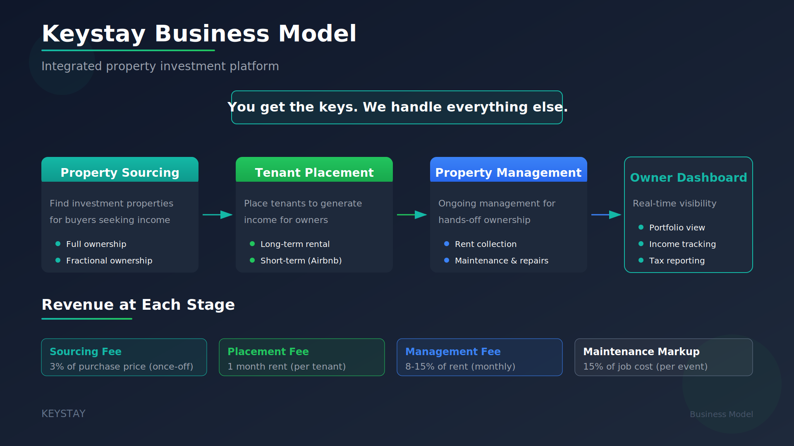

---

### Unit Economics
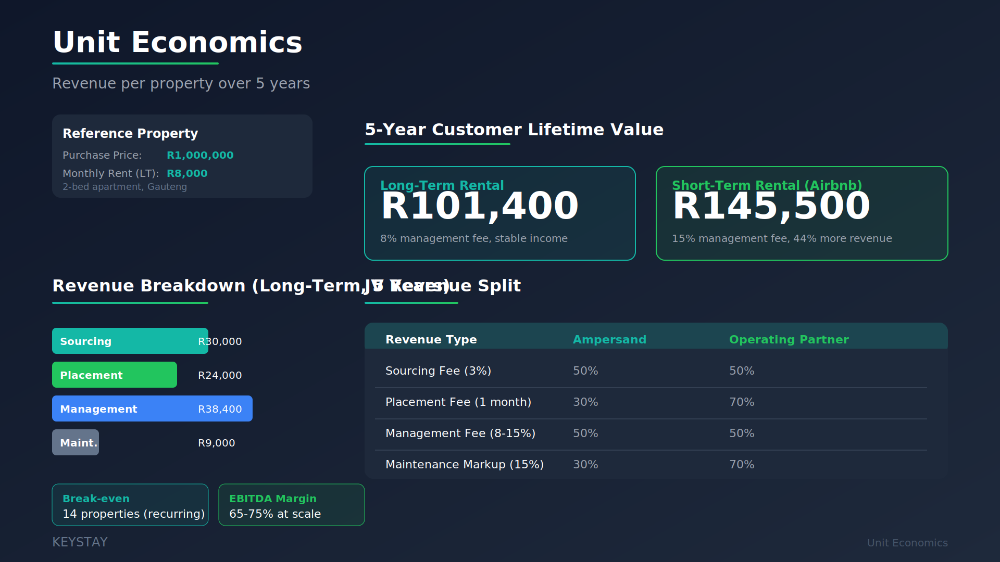

---

### Partner Network Model
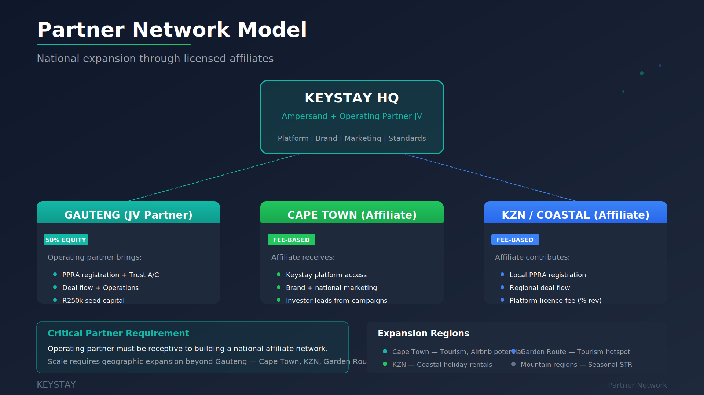

---

### Ideal Partner Profile
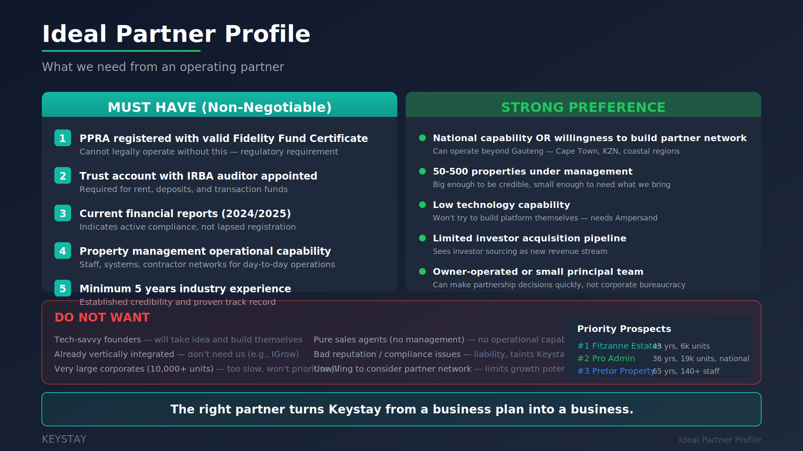

---

## Partner Pitch Deck

### 1. Title
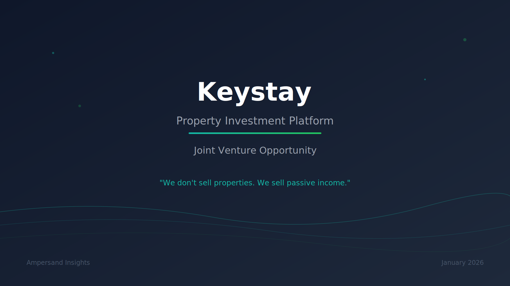

---

### 2. The Opportunity
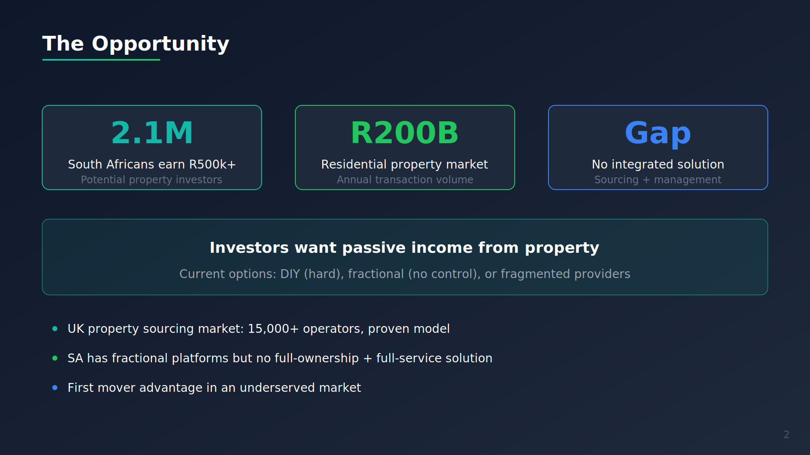

---

### 3. The Problem
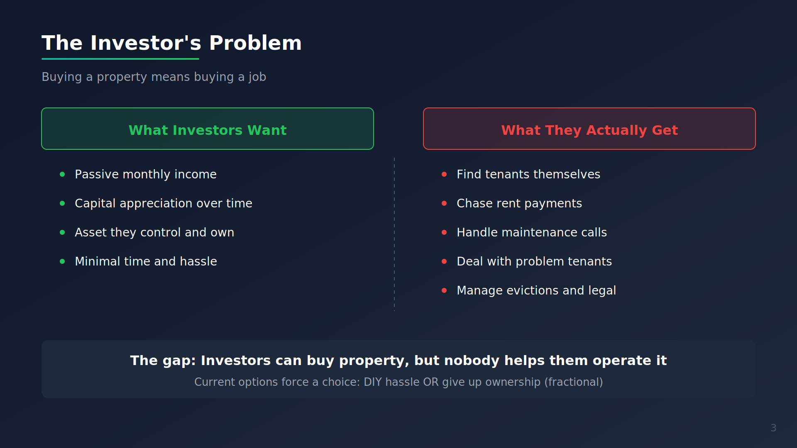

---

### 4. Our Solution
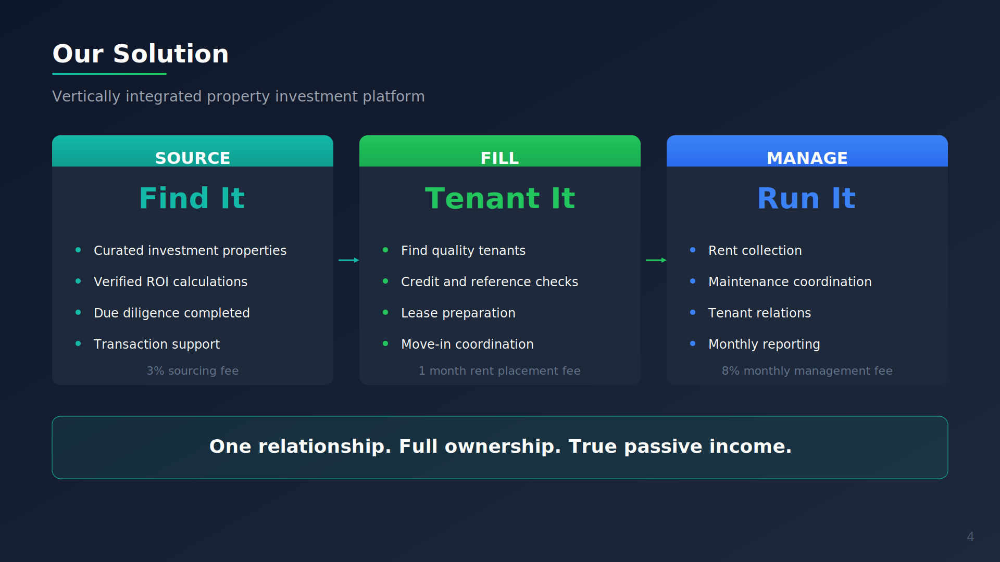

---

### 5. The Economics
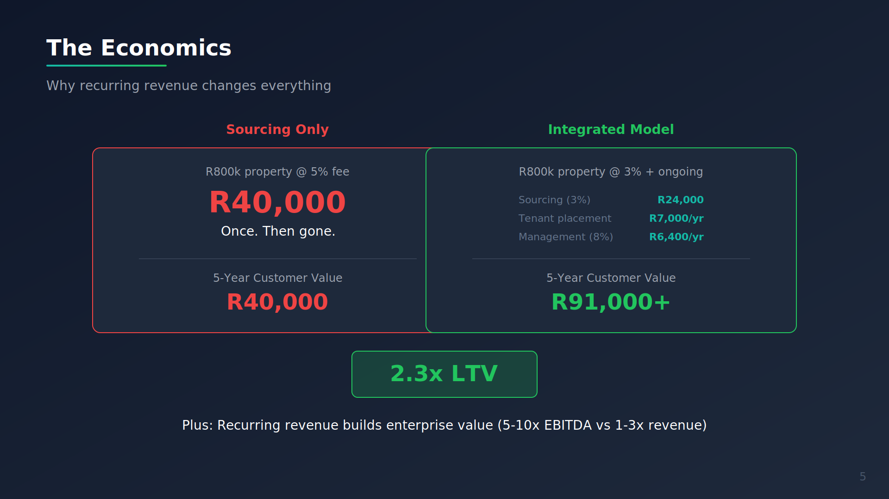

---

### 6. The Partnership
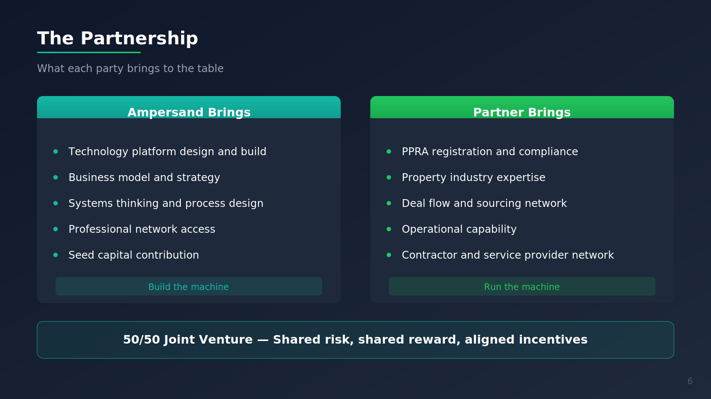

---

### 7. Ideal Partner Profile
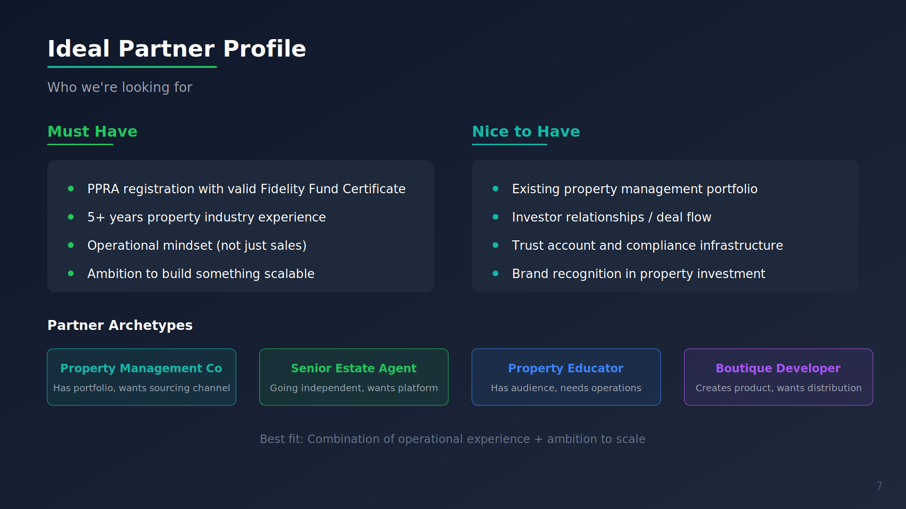

---

### 8. Financial Opportunity


---

### 9. Next Steps
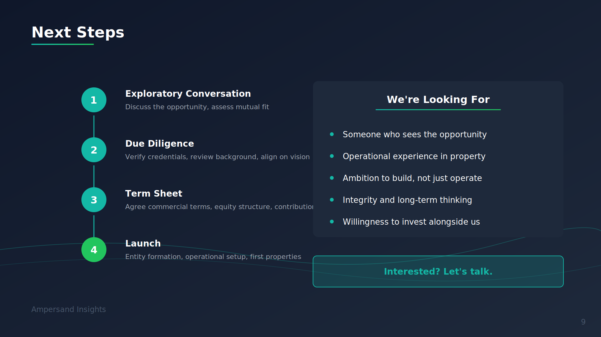

---

*"You get the keys. We handle everything else."*
